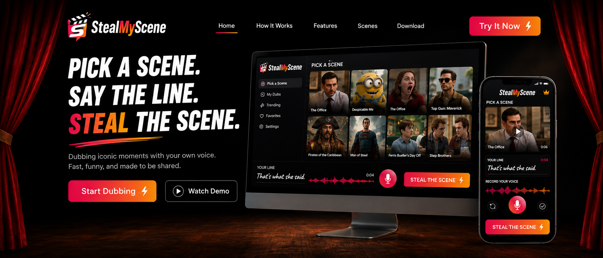

# StealMyScene

> Pick a scene. Say the line. Steal the scene.



StealMyScene is a browser-first dubbing experience built for fast, funny performances. Choose a short original scene, follow the timed line, record your voice, preview your take, and download the finished MP4.

No signup. No forced upload. Unlimited retakes.

## The experience

1. **Pick a scene** from the original, rights-cleared catalog.
2. **Perform the line** while the transcript follows the scene timing.
3. **Preview your take** with instant playback and unlimited retries.
4. **Render locally** in the browser and download a finished video.

## What makes it different

- **Fast start:** The complete guest flow works without an account.
- **Private by default:** Voice recordings stay on the device during the Phase 1 flow.
- **Local rendering:** FFmpeg runs in the browser and produces an H.264/AAC MP4.
- **Performance guidance:** Countdown, waveform, timer, and word-level cues keep the take synchronized.
- **Responsive design:** The full experience supports desktop and mobile layouts.
- **Rights-aware publishing:** Internal ingestion blocks scenes until ownership or licensing evidence is recorded.

## What is included

| Area | Included capability |
|---|---|
| Public experience | Homepage, Explore, Trending, How It Works, scene pages, and dubbing studio |
| Dubbing studio | Microphone capture, timed recording, preview, retake, local render, and download |
| Scene catalog | 24 original scenes with versioned media, thumbnails, transcripts, and word timing |
| Admin workflow | Upload, trim, transcription review, metadata, rights review, and publishing |
| Quality gates | Strict TypeScript, linting, automated tests, browser checks, accessibility scans, and production builds |

## Run locally

Requirements:

- Node.js 20.9 or newer
- FFmpeg 6 or newer for rebuilding the scene library and processing admin uploads

```bash
npm install
cp .env.example .env.local
npm run dev
```

Open [http://localhost:3000](http://localhost:3000).

The public guest experience works without environment secrets. Admin authentication and S3/R2 ingestion use the values documented in [`.env.example`](./.env.example).

## Production configuration

The internal ingestion desk is available at `/admin/scenes`. Local development stores quarantined, accepted, and processed media under `var/`.

A production environment should provide:

- Strong `ADMIN_PASSWORD` and `ADMIN_SESSION_SECRET` values
- S3 or Cloudflare R2 storage with CDN delivery
- The object validation worker described in [`infra/storage-trigger/README.md`](./infra/storage-trigger/README.md)
- A production transcription command and model
- A `REBUILD_HOOK_URL` that activates newly published assets
- Real HTTPS with `ENABLE_HSTS=true`

Keep `ENABLE_HSTS=false` during local HTTP development.

## Verify the project

```bash
npm run verify
```

This runs linting, strict TypeScript checks, automated tests, and a complete production build.

The detailed Phase 1 browser, accessibility, privacy, media, admin, and security evidence is recorded in [`docs/PHASE_1_VERIFICATION.md`](./docs/PHASE_1_VERIFICATION.md).

To rebuild the 24-scene original catalog and manifest:

```bash
npm run generate:scenes
```

## Roadmap and project records

The complete guest loop is implemented and verified. The remaining Phase 1 exit signal requires representative real-user traffic before Phase 2 is officially unlocked.

- [`StealMyScene_Complete_Plan.md`](./StealMyScene_Complete_Plan.md) defines the complete product roadmap.
- [`PROJECT_PROGRESS.md`](./PROJECT_PROGRESS.md) tracks every phase, acceptance gate, and delivery commit.
- [`ENGINEERING_EXECUTION_RULES.md`](./ENGINEERING_EXECUTION_RULES.md) defines testing, commit, push, security, and mistake-prevention rules.
